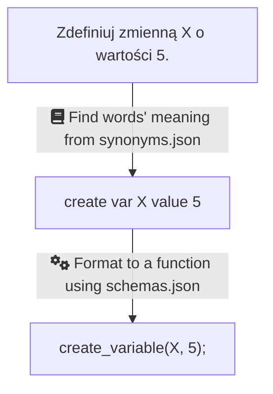

<div align="center">
  
  <p>
    
  </p>
      
  <p>
    
    
    
    
  </p>

</div>

## About

**Kochanowski Programming Language** (KPL) is an esoteric language based on
the Polish language which makes an easy coding problem next to impossible, especially if you don't speak Polish.

## Installation

### Prerequisites

- [ ] [node.js](https://nodejs.org/)

### Installation guide

The following steps will guide you through the process of setting up and configuring the kochanowski package in your project.

1. Begin by creating a new project directory and initializing it with the Kochanowski package. Run the following command in your terminal:

   ```shell
   npm create kochanowski
   ```

2. After the project has been initialized, navigate to your project directory and locate the `indeks.kpl` file. This file contains your KPL script. To compile and run the script, use the following command:
   ```shell
   npm start
   ```

## Quickstart

Write anything in Polish, and it will come to appear. If you encounter a "bug", don't be afraid, as it's working as intended. You can use our pre-made examples:

### Fibonacci sequence

```kpl
Zdefiniuj zmienną pierwsza liczba o wartości równej 1.
Wyczaruj zmienną druga liczba o wartości równej 0.
Spłódź zmienną trzecia liczba o wartości równej 0.

Powtórz przez 10 powtórzeń następujące polecenia.

Zmiennej trzecia liczba przypisz pierwsza liczba dodać druga liczba.
Przypisz wartość druga liczba zmiennej pierwsza liczba.
Zmiennej druga liczba przypisz trzecia liczba.

Wydrukuj druga liczba.

Przejdź do następnej iteracji.
```

### Creating a triangle out of characters

```kpl
Powtórz przez 20 powtórzeń z iteratorem Marcin następujące polecenia.

Zmiennej Krzysiu przypisz 20 minus Marcina podzielić na 2 minus Marcina zmodulowanego na 2 podzielić na 2.
Komentarz autora: 20 - (m/2 - (m%2)/2) -> 20 - m // 2
Napisz Krzysia razy spacje dodać Macina razy X.

Przejdź do następnej iteracji.
```

### Simple grade to comment algorithm

```kpl
Zdefiniuj zmienną ocena o wartości równej 5.

Drukuj "Twój wynik mnie nie satysfakcjonuje".
```

If you have any trouble you can always check the `/data` directory in the module and follow this chart:



## Contributors

<table>
  <tbody>
    <tr>
      <td>
        <a href="https://github.com/CheryX">
          
          <br />
          <sub><b>CheryX</b></sub>
        </a>
      </td>
      <td>
        <a href="https://github.com/Electruu">
          
          <br />
          <sub><b>Electruu</b></sub>
        </a>
      </td>
      <td>
        <a href="https://github.com/ssz256">
          
          <br />
          <sub><b>ssz256</b></sub>
        </a>
      </td>
      <td>
        <a href="https://github.com/Nessie-XII">
          
          <br />
          <sub><b>Nessie-XII</b></sub>
        </a>
      </td>
    </tr>
  </tbody>
</table>
